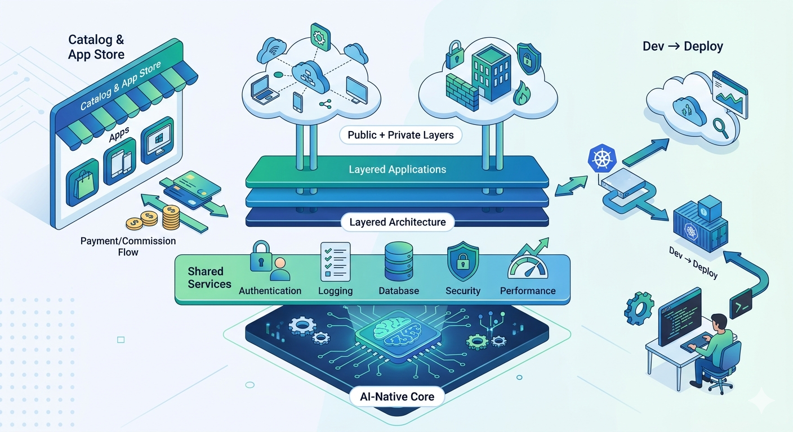

# The Dream...

- Stop reinventing the wheel.

- Enterprise software is usually a 90% fit. Imagine downloading an AI-native 90% foundation and using AI to add your unique 10%.

- A modern framework should deliver logging, database, security, and performance out of the box.

- Deployment should span from free low-bandwidth hosting to massive enterprise scale-out.

- If I build a powerful 90% core application that others extend, I should earn from it.

- If I add my own "secret sauce" to an existing platform, I should be rewarded.

- I want to join one ecosystem once and have all my applications live together.

- AI can produce enterprise-grade software fast. So why are we still paying so much?

- Too many enterprises spend millions customizing software, only to become trapped on outdated versions because upgrades mean redoing the same changes.

- That hurts customers, and it hurts vendors too: vendors get stuck maintaining multiple legacy versions because their customers can’t afford to upgrade.

- Open source is amazing, but too many products share the same core. That core should be built once, shared with everyone, and we can all innovate on top of it.

## The solution

1. Layered application architecture, so applications can build upon each other.

2. Mega-branching, to encourage a hundred flavors of each application.

3. Seamless from development to deployment.

4. Ability to intermix public and private layers.

5. Authentication, logging, database, security, performance, before you even start.

6. Catalog and App Store, payments and commission.

7. AI-Native EVERYTHING.

8. Development and Contribution Gates to ensure compliance with specification, testing, and other requirements.

